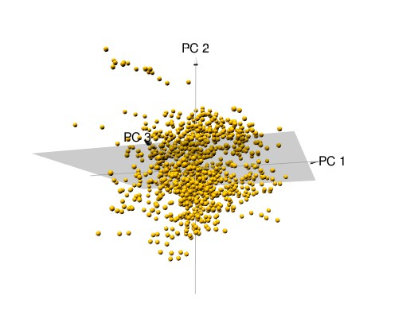

```{r setup, include=FALSE}
knitr::opts_chunk$set(echo = TRUE)
```

# Winter project


```{r}
library(readxl)
df <- read_excel('Data_Cortex_Nuclear.xls')

```

### Step 1. EDA
```{r}
str(df)
summary(df)
```
We see five categorical features and many quantitative features. There are missing values.

Determine the number of mice participating in the experiment.
```{r}
length(unique(df$MouseID))
```
The quantity does not match the description of the dataframe in the source. Let's try to find it using the code.

```{r}
string_names <- sub("_[0-9]+", ".", df$MouseID)
length(unique(string_names))
```
There were a total of 72 mice in the experiment.

Let's see which groups participated in the experiment.

```{r}
unique(df$class)
```
There were 8 groups in the experiment.

Let's look at the balance of groups.

```{r}
library(dplyr)
library(ggplot2)
groups <- df %>% group_by(class) %>% summarise(n())
groups$values <- groups$`n()`
groups$`n()` <- NULL
ggplot(groups, aes(x=class, y=values, fill=class))+
  geom_col()
```

The groups are roughly balanced.

```{r}
hist(groups$values)
```

Most of the groups are the same, but two are much smaller.

There are quite a lot of missing values in the data. Let's deal with them radically - remove the observations where there is NA.

```{r}
df_full <- na.omit(df)

```

Let's look at the balance of groups after the procedure.

```{r}
groups2 <- df_full %>% group_by(class) %>% summarise(n())
groups2$values <- groups2$`n()`
groups2$`n()` <- NULL
ggplot(groups2, aes(x=class, y=values, fill=class))+
  geom_col()
```
Now the groups are even more unbalanced, however this seems uncritical and there is no NA.

```{r}
hist(groups2$values)
```

Let's see how many mice are left after the execution.

```{r}
string_names2 <- sub("_[0-9]+", ".", df_full$MouseID)
length(unique(string_names2))
```

Congratulations, half the mice died for nothing; we just threw out their data in the analysis -_-
Statistics are cruel.

(Everything is not so bad, we will try to get around this limitation and the contribution of mice will not be forgotten.)

### Step 2. BDNF_N

We investigate whether there are differences in BDNF_N expression between classes.

*We use untransformed data in this step, with NA. This will increase the power at the expense of the number of observations (na_omit removes all observations from NA, but not all of them will be in BDNF_N).*

*Hooray, mice, your death will not be in vain!*

Let's visualize the data first.

```{r}
ggplot(df, aes(x=class, y=BDNF_N, fill=class))+
  geom_boxplot()+
  theme_bw()
```

We see outliers, they should be removed (there aren't many of them, so we'll just delete them).We also need to check the normality of the distribution and the homogeneity of the variances.

```{r}
df_BDNF = df

bad_samples = c(df_BDNF[which(df_BDNF$class == "c-CS-m" & (df_BDNF$BDNF_N > 0.45 | df_BDNF$BDNF_N < 0.22)),]$MouseID, 
df_BDNF[which(df_BDNF$class == "c-CS-s" & df_BDNF$BDNF_N > 0.47),]$MouseID, 
df_BDNF[which(df_BDNF$class == "c-SC-m" & (df_BDNF$BDNF_N > 0.37 | df_BDNF$BDNF_N < 0.18)),]$MouseID, 
df_BDNF[which(df_BDNF$class == "c-SC-s" & (df_BDNF$BDNF_N > 0.409 | df_BDNF$BDNF_N < 0.225)),]$MouseID, 
df_BDNF[which(df_BDNF$class == "t-CS-m" & df_BDNF$BDNF_N > 0.45),]$MouseID, 
df_BDNF[which(df_BDNF$class == "t-CS-s" & df_BDNF$BDNF_N > 0.45),]$MouseID) 

df_BDNF = df_BDNF[-which(df_BDNF$MouseID %in% bad_samples), ]

ggplot(df_BDNF, aes(x=class, y=BDNF_N, fill=class))+
  geom_boxplot()+
  theme_bw()
```

Already better, we will correct a little more

```{r}
df_BDNF = df

bad_samples = c(df_BDNF[which(df_BDNF$class == "c-CS-m" & (df_BDNF$BDNF_N > 0.45 | df_BDNF$BDNF_N < 0.22)),]$MouseID, 
                df_BDNF[which(df_BDNF$class == "c-CS-s" & df_BDNF$BDNF_N > 0.47),]$MouseID, 
                df_BDNF[which(df_BDNF$class == "c-SC-m" & (df_BDNF$BDNF_N > 0.37 | df_BDNF$BDNF_N < 0.2)),]$MouseID, 
                df_BDNF[which(df_BDNF$class == "c-SC-s" & (df_BDNF$BDNF_N > 0.40 | df_BDNF$BDNF_N < 0.225)),]$MouseID, 
                df_BDNF[which(df_BDNF$class == "t-CS-m" & df_BDNF$BDNF_N > 0.45),]$MouseID, 
                df_BDNF[which(df_BDNF$class == "t-CS-s" & df_BDNF$BDNF_N > 0.4),]$MouseID) 

df_BDNF = df_BDNF[-which(df_BDNF$MouseID %in% bad_samples), ]

ggplot(df_BDNF, aes(x=class, y=BDNF_N, fill=class))+
  geom_boxplot()+
  theme_bw()
```

Fine. Let's look at class balance

```{r}
ggplot(df_BDNF, aes(x=class, y=BDNF_N, fill=class))+
  geom_col()
```

More or less uniform classes. Now let's check if we can use ANOVA at all:

1) Are the groups normally distributed?

```{r}
df_BDNF %>% group_by(class) %>%
  summarise(p.value = shapiro.test(BDNF_N)$p.value)
```

No. So we will use the nonparametric analogue of ANOVA

2) Equality of variances

```{r}
bartlett.test(BDNF_N~class, data=df_BDNF)
```

But this is already a problem. Homogeneity of variances is not respected, so we cannot actually use either ANOVA or Kruskal-Wallis test. Could this be due to the removal of outliers?

```{r}
bartlett.test(BDNF_N~class, data=df)
```

No, that's not the point. Let's try another criterion.

```{r}
library(car)
leveneTest(BDNF_N~class, data=df_BDNF)
```

Similar result.

Here, in fact, we could transform the data (although they are already logarithmic, judging by the description). We could also use other techniques such as generalized linear models. But we'll try something a little different (because I don't know much about GLMs).Let's assume that I didn't do these tests and do an ANOVA

```{r}
df_BDNF = df_BDNF[-which(is.na(df_BDNF$BDNF_N)),] # remove NA's
aov_model <- aov(BDNF_N~class, df_BDNF)
summary(aov_model)
```

ANOVA shows significant differences. Let's diagnose the model:

```{r}
hist(residuals(aov_model))
```

The residuals are normally distributed.

```{r}
df_BDNF$residuals <- residuals(aov_model)
ggplot(df_BDNF, aes(x = class, y = residuals))+
  geom_jitter(width = 0.1, alpha = 0.5)
```

The variances of residuals by eye also differ little. Yes, and on boxplot, the variances were not super different. In the course on statistics on the Stepik, it was said that with large samples, even minor deviations are recognized as statistically significant and standard tests may show an incorrect result (a simulated sample from a normal distribution with a large N gave a negative result on the Shapiro-Wilk test). Let's try a non-perimetric analysis.

```{r}
kruskal.test(BDNF_N~class, data=df_BDNF)
```

The test also showed significant differences. We can’t trust him 100% straight, we’ll check it on pairwise comparisons using Dann’s test with Holm’s correction.

```{r}
library("rstatix")
df_BDNF %>% 
  dunn_test(BDNF_N~class, p.adjust.method = "holm")
```

Pairwise comparisons show significant differences. Probably, we will be more inclined to believe that there really are differences, although these data should be treated with caution.


### Step 3. Regression


##### Let's build all-features model:
1) Data preparation

First, replace the gaps with the average (not the best strategy, but we'll try)

```{r}
# replace NAs with group means
df_fill_na <- df[,-c(1,81,80,79)]

for (i in 1:ncol(df_fill_na)-1){
  if(any(is.na(df_fill_na[,i])) == T){
    values_na = which(is.na(df_fill_na[,i]))
    for (j in 1:length(values_na)){
      class_of = df_fill_na$class[values_na[j]]
      df_fill_na[values_na[j],i] = mean(df_fill_na[which(df_fill_na[,ncol(df_fill_na)] == class_of),i][[1]]
                             , na.rm = T)
    }
  } 
}

any(is.na(df_fill_na))

```

Ok, let's split the data into training and test sets.

```{r}
y <- df_fill_na$ERBB4_N
x <- df_fill_na[-c(78, which(colnames(df_fill_na) == 'ERBB4_N'))] # remove categorial feachures and target
set.seed(7)
train <- sample(1:nrow(x), nrow(x)*0.75) # ala train/test split

x_train <- as.matrix(x[train, ])
y_train <- y[train]
x_test <- as.matrix(x[-train, ])
y_test <- y[-train]
```


The expression of different proteins is different, so we standardize the data.

```{r}
x_train_scaled <- scale(x_train)
x_test_scaled <- scale(x_test, center=apply(x_train, 2, mean), scale=apply(x_train, 2, sd))
nwe_data <- data.frame(cbind(x_train_scaled, y_train))
```

2) Model with all predictors

```{r}
lin_mod <- lm(y_train~., nwe_data)
summary(lin_mod)
```

Conclusion: a lot of insignificant features, but the coefficient of determination, even corrected, is quite good; the model is statistically significant. Let's check it with test data.

3) Test evaluation

```{r}
y_pred <- predict(lin_mod, data.frame(x_test_scaled))
r2 <- 1 - sum((y_test - y_pred)**2)/sum((y_test - mean(y_test))**2)
cat("R-squared: ", r2)
```

The score changed. At the same time, we observe that there is a gene whose coefficients are NA.

##### Let's try to make feature selection based on the multicolinearity criterion. In theory, we should have almost only significant features left.


1) Estimate vif-score

To use vif you must first check for full multicollinearity
```{r}
library(car)
alias(lin_mod)
```

Let's remove the ARC_N variable and build the model again. Then we use vif() and remove all variables that are greater than 10.

```{r}
x_train_scaled_new <- scale(x_train[,-which(colnames(x_train) == "ARC_N")])
x_test_scaled_new <- scale(x_test[,-which(colnames(x_train) == "ARC_N")], 
                           center=apply(x_train[,-which(colnames(x_train) == "ARC_N")], 2, mean), 
                           scale=apply(x_train[,-which(colnames(x_train) == "ARC_N")], 2, sd))

nwe_data_2 <- data.frame(cbind(x_train_scaled_new, y_train))
lin_mod_2 <- lm(y_train~., nwe_data_2)
summary(lin_mod_2)

```
There are still many insignificant coefficients, but we got rid of NA for the pS6_N gene and its coefficient became significant. Now let's apply a function that shows multicolinear features. We select only features without multicolinearity.

```{r}
which(vif(lin_mod_2) < 10)
```

2) Let us build a model with only non-collinear features.

```{r}
x_train_scaled_new <- x_train_scaled_new[,which(vif(lin_mod_2) < 10)]
x_test_scaled_new <- x_test_scaled_new[,which(vif(lin_mod_2) < 10)]

nwe_data_3 <- data.frame(cbind(x_train_scaled_new, y_train))
lin_mod_3 <- lm(y_train~., nwe_data_3)
summary(lin_mod_3)

```

```{r}
vif(lin_mod_3)

y_pred_3 <- predict(lin_mod_3, data.frame(x_test_scaled_new))
r2 <- 1 - sum((y_test - y_pred_3)**2)/sum((y_test - mean(y_test))**2)
cat("R-squared: ", r2)
```

Now the model has more significant features. The R-score hasn't dropped much.
There is no multicolinearity, so we can trust the coefficients.


3) We select all significant features and build a model with them.

```{r}
sign_coef = data.frame(summary(lin_mod_3)$coefficients)

data_train_4 = x_train_scaled_new[,
                                  rownames(sign_coef[sign_coef$Pr...t.. < 0.05, ])[-1]]

data_test_4 = x_test_scaled_new[,
                                 rownames(sign_coef[sign_coef$Pr...t.. < 0.05, ])[-1]]

nwe_data_4 <- data.frame(cbind(data_train_4, y_train))
lin_mod_4 <- lm(y_train~., nwe_data_4)
summary(lin_mod_4)
```

We get a model with significant variables. Let's check it on test data.

```{r}
y_pred_4 <- predict(lin_mod_4,data.frame(data_test_4))
r2 <- 1 - sum((y_test - y_pred_4)**2)/sum((y_test - mean(y_test))**2)
cat("R-squared: ", r2)
```

The R-value is practically the same, and all coefficients are significant. Fine.


#### Let's evaluate the fairness indicators of the models according to the graphs.

Model with all predictors:
```{r}
plot(lin_mod)
```

Model with selected features:
```{r}
plot(lin_mod_4)
```


Both models are pretty good. The rests are distributed more or less normally, the rest of the graphs are also okay (sort of).

#### Conclusion:

Quite good models were built. The model with selected predictors is slightly inferior in R2 value, but has significant coefficients, which is good for interpretation: for example, the pS6_N and IL1B_N genes are associated with an increase, and BAD_N with a suppression of ERBB4_N expression (according to the constructed model).

### Step 4. PCA

1) Ordination
```{r}
library(vegan)
study_fit_pca <- rda(scale(df_fill_na[-78]))

```

2) Graphs of factor loadings

```{r}
biplot(study_fit_pca, display = 'species', scaling = 'species')

```

It can be seen that there are many multicolinear variables (which was confirmed at the stage of linear regression)

+Screeplot

```{r}
screeplot(study_fit_pca, type = "lines", bstick = TRUE)
# On this graph we can see, that 8 components we can consider
```
3) Percent variance for each component
```{r}
su <- summary(study_fit_pca)
su$cont
```

We need 6 components to explain 70% of dispersion

4) 3D plot for the first 3 components

```{r}
library('pca3d')
pca <- prcomp(scale(df_fill_na[-78]))
# This code create 3D-plot in separate window and we save Fig and load it into RMD
#pca3d(pca) 
#snapshotPCA3d(file="first_plot.png")
```

```{r, echo=FALSE, fig.cap="A caption", out.width = '100%'}

```


### Step 5. sPLS-DA

Let's transform the data

```{r}
library(mixOmics)
library(dplyr)
X <- df_fill_na[-78]
Y <- df_fill_na$class
```

Selection of parameters based on cross-validation:

```{r}
list.keepX <- c(5:10,  seq(20, 100, 10))
set.seed(30) 
# the number of components is taken as the number of groups-1
tune.splsda.srbct <- tune.splsda(X, Y, ncomp = 7,
                                 validation = 'Mfold',
                                 folds = 3, dist = 'max.dist', progressBar = FALSE,
                                 measure = "BER", test.keepX = list.keepX,
                                 nrepeat = 10)   
ncomp <- tune.splsda.srbct$choice.ncomp$ncomp 
```

We determine which components and with what number of features should be left
```{r}
select.keepX <- tune.splsda.srbct$choice.keepX[1:ncomp] 
select.keepX
```

Let's draw a graph. RMD constantly rolled out an error, so I made a separate graph and saved it. Everything works fine in code mode, but Knit doesn't want to link the document.

```{r}
MyResult.splsda.fixed <- splsda(X, Y, ncomp = ncomp, keepX = select.keepX)
#
layout(matrix(c(1, 2, 3, 3, 3, 3), 2, 3))
plotLoadings(MyResult.splsda.fixed, comp = 1, size.name = 1, size.title = 1.2, title = "Loadings\n on 1st component", contrib = "max", legend = F, ndisplay = 5)
#
plotLoadings(MyResult.splsda.fixed, comp = 2, size.name = 1, size.title = 1.2, title = "Loadings\n on 2nd component", contrib = "max",ndisplay = 5,  legend = F)
#
plotIndiv(MyResult.splsda.fixed, ind.names = F, ellipse = T, style = "graphics", abline = TRUE, cex = 2, pch = 19, size.axis = 1.2, size.xlabel = 1.5, size.ylabel = 1.5, title = "sPLS-DA ordination of samples", size.title = 1.5)
legend("bottomright", legend = levels(factor(df_fill_na$class)), cex = 1.5, fill = color.mixo(1:8), bty = "n")

```


#### Let's make a conclusion. The groups are not well demarcated. According to our ordination: 

##### 1) The main feature for separation is rather stimulation to learning (CS/SC), which leads to variability in the first component;

##### 2) Proteins pS6_N, ARC_N, Ubiquitin_N, TIAM_1_N, RAPTOR_N are characteristic of the t-SC-m group; SOD1_N for c-SC-s group; CaNA_N for group t-CS-m; APP_N, PKCA_N for group s-CS-s; AMPKA_N and pNUMB_N for c-CS-m;

##### 3) Considering the value of the first component, it can be assumed that CaNA_N and SOD1_N proteins change the most depending on the presence of stimulation.


